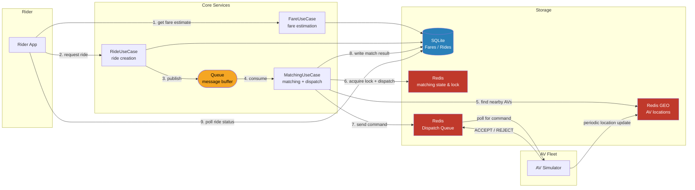
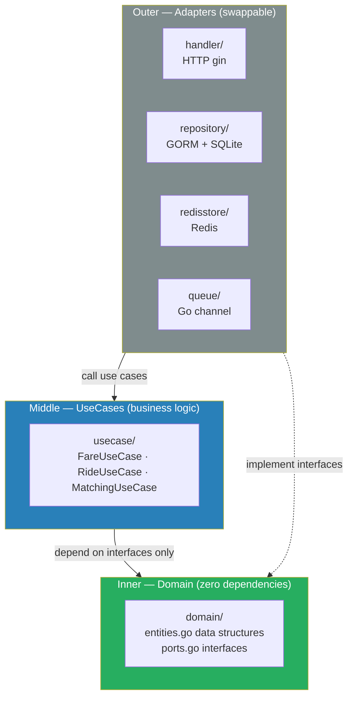

# Robotaxi System Design — Go Implementation

A working implementation of a robotaxi ride-matching system, built with Go following **Clean Architecture**, **Hexagonal (Ports & Adapters)** patterns, and idiomatic Go conventions.

## Architecture



### Layer Structure (Clean Architecture)

> Dependencies point inward — outer layers know about inner layers, never the reverse.



## System Design Concepts

| Deep Dive | Problem | Solution | Code Location |
|---|---|---|---|
| Deep Dive 1 | 10M AVs × 1 update/5s = 2M writes/sec | Redis `GEOADD` / `GEOSEARCH` | `redisstore/location.go` |
| Deep Dive 2 | Requests dropped at peak load | Async queue between Ride Service & Matching | `queue/queue.go`, `usecase/ride.go` |
| Deep Dive 3 | Same ride → multiple AVs | Per-ride `SET NX EX` lock + shared Redis state | `redisstore/location.go`, `usecase/matching.go` |
| Deep Dive 4 | Same AV → multiple rides | DB transaction + uniqueness check (partial index equivalent) | `repository/ride_repo.go` → `AssignAV()` |

## API

### Rider
| Method | Path | Description |
|--------|------|-------------|
| `POST` | `/fare` | Get fare estimate |
| `POST` | `/rides` | Request a ride (triggers async matching) |
| `GET`  | `/rides/:id` | Poll ride status |

### AV (simplified from gRPC to HTTP)
| Method | Path | Description |
|--------|------|-------------|
| `POST` | `/av/location` | Send location update |
| `GET`  | `/av/:id/dispatch` | Poll for dispatch command |
| `POST` | `/av/:id/dispatch/:ride_id/decision` | Submit ACCEPT/REJECT |

## How to Run

**Prerequisites:** Go 1.21+, Docker

```bash
# 1. Start Redis
docker-compose up -d

# 2. Start the server
go run ./cmd/server

# 3. Start the AV fleet simulator (separate terminal)
go run ./scripts/simulate_av

# 4. Test the flow
# Step 1: Get fare estimate
curl -s -X POST http://localhost:8080/fare \
  -H "Content-Type: application/json" \
  -d '{"pickup_location":{"lat":37.7749,"lng":-122.4194},"destination":{"lat":37.7849,"lng":-122.4094}}'

# Step 2: Request a ride (use fare_id from above)
curl -s -X POST http://localhost:8080/rides \
  -H "Content-Type: application/json" \
  -d '{"fare_id":"<fare_id>"}'

# Step 3: Poll until DRIVER_ASSIGNED
curl -s http://localhost:8080/rides/<ride_id>
```

## Testing

```bash
go test ./...               # all tests
go test -race ./...         # with race detector
go test -cover ./...        # with coverage
```

Tests follow table-driven patterns with interface-based mocks — no real DB or Redis required.

## Redis Key Schema

```
geo:av_locations            GEO set: all AV positions
av:status:{av_id}           HASH: status, battery_level, lat, lng
dispatch:av:{av_id}         LIST: pending dispatch commands
decision:ride:{r}:av:{a}    LIST: AV's ACCEPT/REJECT response
match:ride:{ride_id}        HASH: candidates, cursor, status (SEARCHING|DONE)
match:lock:{ride_id}        STRING (SET NX EX): per-ride distributed lock
```

## Production Differences

| This demo | Production |
|-----------|-----------|
| `queue.RideQueue` (in-memory chan) | Kafka / AWS SQS |
| SQLite | PostgreSQL + partial unique index on `rides(av_id)` |
| HTTP polling for AV dispatch | gRPC bidirectional stream |
| Single Redis instance | Redis Cluster (for 2M writes/sec) |
| Single matching goroutine | Horizontally scaled stateless workers |
